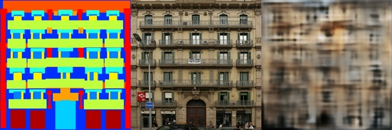

# Assignment 2 - DIP with PyTorch

---

### 1. Implement Poisson Image Editing with PyTorch.

使用laplace mask

$$
\left[
\begin{matrix}
0 &-1& 0\\
-1 &4&-1\\
0&-1&0
\end{matrix}\right]
$$
计算前景图和背景图对应框选的多边形的离散散度，并通过梯度下降修改背景图以减小两者的散度差.

### 2. Pix2Pix implementation.

#### facades

train结果

val结果

#### edges2shoes

train结果

val结果

